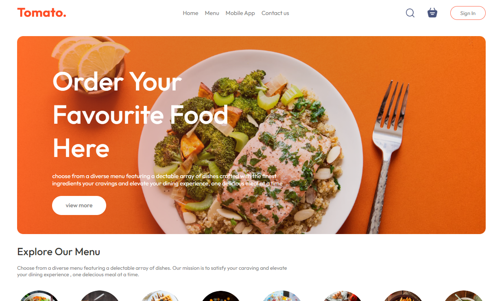

# Food Delivery App

A ReactJS application for ordering food online and getting it delivered to your doorstep.

## Getting Started

### Prerequisites

- Node.js (version 14 or higher)
- npm (version 6 or higher)
- A code editor or IDE of your choice

### Installation

1. Clone the repository: `git clone https://github.com/iftekharalammithu/food-delivery-app-fontend.git`
2. Install dependencies: `npm install`
3. Start the development server: `npm start`

### Running the App

- Open [http://localhost:3000](http://localhost:3000) in your web browser to access the app.

## Features

- User authentication and authorization
- Restaurant listing with filtering and sorting
- Food item listing with details and reviews
- Cart management with quantity update and removal
- Order placement and tracking
- Payment gateway integration (coming soon!)

## Technologies Used

- ReactJS (version 17)
- React Router (version 5)
- Redux (version 4)

## Folder Structure

- `public/`: Static assets and index.html
- `src/`: Application source code
  - `components/`: Reusable React components
  - `containers/`: Higher-order components
  - `actions/`: Redux actions
  - `api/`: API calls and data fetching
  - `utils/`: Utility functions
  - `index.js`: Application entry point
  - `App.js`: Main application component

## Contributing

Contributions are welcome! If you'd like to contribute to this project, please fork the repository and submit a pull request.

## License

This project is licensed under the MIT License. See [LICENSE](LICENSE) for details.

## Social Media

Follow on social media:

 <!--  -->
 <!--  -->

## Issues and Feedback

If you encounter any issues or have feedback, please open an issue on this repository or contact me directly.

Happy coding!
